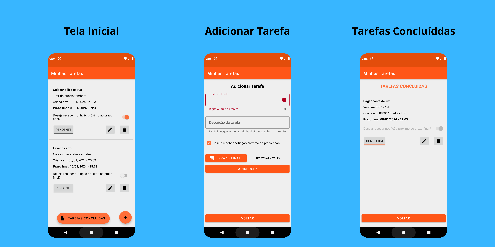

## 💻 Projeto

Minhas Tarefas é um aplicativo para auxiliar no controle de suas tarefas. Crie, atualize, delete e marque como concluídas, e como lembrete, tenha a opção de receber notificação 1 hora antes do prazo final da sua tarefa. As tarefas são armazenadas localmmente no dispositivo, o aplicativo usa o próprio SQLite do Android.

  

## 🛠️ Features

- Criação de tarefas
- Edite tarefas criadas
- Delete tarefas
- Conclua tarefas
- Receba notificação próximo ao prazo final

## 📄 Licença

Esse projeto está sob a licença MIT. Veja o arquivo [license](./license) para mais detalhes.

 
